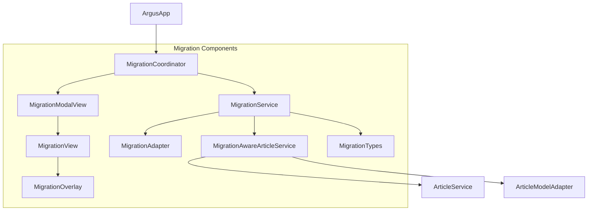

# Migration Removal Plan: Argus iOS App

This document outlines the plan for the complete removal of the migration system once all users have successfully migrated to the new SwiftData architecture. The migration system was designed with a self-contained architecture to allow for easy removal once it's no longer needed.

## Migration Architecture Overview

The migration system uses a coordinator pattern to ensure clean isolation and future removability, with an emphasis on running exactly once per device:

This architecture ensures:
1. Single entry point through the MigrationCoordinator
2. Complete isolation of migration logic
3. Minimal touch points with the main application
4. One-time execution with persistent state tracking
5. Easy removal when migration is complete for all users

## Component Documentation

### 1. MigrationCoordinator.swift
- **Purpose**: Central entry point that orchestrates the entire migration process
- **Dependencies**: MigrationService, MigrationModalView, UserDefaults
- **Key Functions**:
  - `checkMigrationStatus()`: Determines if migration is needed
  - `startMigration()`: Initiates the migration process
  - `completeMigration()`: Handles migration completion
  - `markMigrationCompleted()`: Used when source tables don't exist but migration needs to be marked complete
- **State Management**: 
  - Uses UserDefaults keys to track migration state:
    - `migration_completed`: Boolean flag for completion status
    - `migration_count`: Number of times migration has been attempted
    - `last_migration_date`: Timestamp of the most recent migration
- **Removal Considerations**:
  - This is the primary entry point from ArgusApp.swift
  - All other migration components are referenced through this coordinator
  - Can be entirely removed once all users have migrated

### 2. MigrationService.swift
- **Purpose**: Performs the actual data migration between legacy database and SwiftData
- **Dependencies**: 
  - SwiftDataContainer: Provides access to the new SwiftData storage
  - MigrationAwareArticleService: Bridges old and new storage systems
  - MigrationTypes: Uses shared data structures for migration state
- **Key Functions**:
  - `migrateAllData()`: Main migration function
  - `processBatchWithStateSync()`: Handles batch migration with state tracking
  - `saveMigrationProgress()`: Persists migration state to UserDefaults
- **Removal Considerations**:
  - Contains direct references to legacy database schema
  - Handles batch processing of migration data
  - Legacy database tables can be safely dropped after removal

### 3. MigrationView.swift & MigrationModalView.swift
- **Purpose**: UI components that display migration progress
- **Dependencies**: MigrationCoordinator for progress updates
- **Key Functions**:
  - Display migration progress visually
  - Block user interaction during migration
  - Present completion status
- **Removal Considerations**:
  - These views are only displayed during migration
  - Self-contained with no external dependencies other than coordinator
  - Can be removed simultaneously

### 4. MigrationOverlay.swift
- **Purpose**: Visual overlay displayed during migration
- **Dependencies**: MigrationView
- **Key Functions**:
  - Provides a modal overlay that blocks interaction
  - Displays migration UI components
- **Removal Considerations**:
  - Pure UI component with no business logic
  - Can be removed along with other UI components

### 5. MigrationTypes.swift
- **Purpose**: Defines data structures and enums used throughout migration
- **Dependencies**: None (only imported by other migration components)
- **Key Structures**:
  - `MigrationState`: Enum tracking migration phases
  - `MigrationProgress`: Structure for storing migration progress
  - `MigrationError`: Error types specific to migration
  - `MigrationMetrics`: Performance tracking for migration
- **Removal Considerations**:
  - Should be removed after all components that reference it
  - No types have leaked into public interfaces

### 6. MigrationAwareArticleService.swift
- **Purpose**: Compatibility layer that bridges old and new article services
- **Dependencies**: ArticleService, MigrationAdapter
- **Key Functions**:
  - Forwards standard operations to ArticleService
  - Provides migration-specific methods for legacy data access
  - Handles state synchronization during migration
- **Removal Considerations**:
  - Already marked with deprecation notices
  - All clients should be using ArticleService directly
  - May be the most complex to remove due to potential lingering references

### 7. MigrationAdapter.swift
- **Purpose**: Converts between legacy and modern data models
- **Dependencies**: ArticleModelAdapter
- **Key Functions**:
  - Translates between NotificationData and ArticleModel
  - Handles direct article processing for legacy system
- **Removal Considerations**:
  - Used by MigrationService during the migration process
  - No external clients should be using this directly

## Dependency Map

The migration system has been designed with clear dependencies that facilitate targeted removal:

| Component | Depends On | Depended On By |
|-----------|------------|----------------|
| MigrationCoordinator | MigrationService, MigrationModalView, UserDefaults | ArgusApp |
| MigrationService | MigrationAwareArticleService, SwiftDataContainer, MigrationTypes | MigrationCoordinator |
| MigrationModalView | MigrationCoordinator, MigrationView | MigrationCoordinator |
| MigrationView | MigrationOverlay | MigrationModalView |
| MigrationOverlay | None | MigrationView |
| MigrationTypes | None | MigrationService, MigrationCoordinator |
| MigrationAwareArticleService | ArticleService, MigrationAdapter | MigrationService |
| MigrationAdapter | ArticleModelAdapter | MigrationAwareArticleService |

## Removal Plan

### Phase 1: Preparation (Pre-Removal)
1. **Verify Migration Completion**:
   - Add analytics to track the percentage of users who have completed migration
   - Wait until this percentage reaches >99% or X months after release (e.g., 6 months)
   - Verify no errors are being reported in migration logs

2. **Audit External References**:
   - Search for any remaining references to MigrationAwareArticleService
   - Ensure all clients are using ArticleService directly
   - Update any remaining code to use the direct implementation

3. **Add Final Deprecation Notices**:
   - Update deprecation notices with more explicit messages
   - Add compiler warnings for any remaining usage

4. **Update Bootstrap Code**:
   - Modify ArgusApp.swift to skip migration initialization
   - Add conditional code that can be easily removed in the next phase

### Phase 2: UI Component Removal
1. **Remove MigrationOverlay.swift**
   - Pure UI component with no business logic dependencies

2. **Remove MigrationView.swift**
   - UI component that depends only on MigrationOverlay

3. **Remove MigrationModalView.swift**
   - UI component that depends on MigrationView

4. **Remove UI-related Assets**
   - Remove any migration-specific assets or resources

### Phase 3: Service Component Removal
1. **Remove MigrationAdapter.swift**
   - Used only by MigrationAwareArticleService

2. **Remove MigrationAwareArticleService.swift**
   - Remove after verifying no external references
   - All clients should be using ArticleService directly

3. **Remove MigrationService.swift**
   - Core implementation of migration logic
   - Only referenced by MigrationCoordinator

### Phase 4: Final Cleanup
1. **Remove MigrationTypes.swift**
   - Contains data structures used by other migration components
   - Remove after all dependent components are removed

2. **Remove MigrationCoordinator.swift**
   - Primary entry point for migration system
   - Remove after all other components are removed

3. **Clean Up UserDefaults**
   - Remove migration-related UserDefaults keys:
     - `migration_completed`
     - `migration_count`
     - `last_migration_date`
     - `migrationProgress`

4. **Update ArgusApp.swift**
   - Remove migration initialization code
   - Remove any conditional checks for migration status

5. **Clean Up Logging**
   - Remove migration-specific logging in ModernizationLogger

## Migration Integrity Preservation

During the removal process, it's important to maintain database integrity and prevent accidental re-migration:

1. **UserDefaults Preservation**:
   - Maintain the `migration_completed` key in UserDefaults even after removal
   - This prevents accidental re-migration if old code is somehow reinstated

2. **Database Verification**:
   - Before removal, verify all data has been successfully migrated
   - Run validation queries to confirm data integrity
   - Consider adding a one-time data integrity check at app startup

3. **Legacy Database Handling**:
   - After migration system removal, the legacy database files can be safely deleted
   - Consider adding a cleanup step to remove these files after detection of a clean system

## Testing Strategy

To validate the migration system removal doesn't break functionality:

1. **Pre-Removal Testing**:
   - Create test cases that verify all data is accessible after commenting out migration code
   - Verify that all features work properly with migration code disabled
   - Test app performance after disabling migration code

2. **Phased Testing**:
   - Test each phase of removal separately
   - After removing UI components, verify the app still functions
   - After removing service components, verify all data operations work

3. **Post-Removal Verification**:
   - After complete removal, perform full regression testing
   - Verify startup performance has improved
   - Confirm all data operations function properly
   - Test cross-device syncing via CloudKit

## Timeline Recommendations

The following timeline is recommended for the migration system removal:

1. **Monitoring Phase**: 2-3 months after public release
   - Track migration completion rates
   - Identify any migration issues
   - Prepare for removal

2. **Preparation Phase**: 3-6 months after public release
   - Begin Phase 1 preparations
   - Add analytics to verify migration completion
   - Update documentation

3. **Removal Phase**: 6+ months after public release
   - Implement Phases 2-4 of the removal plan
   - Test thoroughly after each phase
   - Release as a minor version update

4. **Verification Phase**: Post-removal
   - Monitor for any issues related to removal
   - Confirm all features work as expected
   - Verify performance improvements

## Risks and Mitigations

| Risk | Mitigation |
|------|------------|
| Some users haven't migrated | Wait for adequate time after release before removal; keep migration_completed flag in UserDefaults |
| Data integrity issues after removal | Run extensive testing on migrated data; perform integrity checks |
| Unexpected dependencies on migration components | Thorough code audit before removal; gradual phased removal |
| Performance regressions | Test performance at each phase; monitor analytics after removal |
| CloudKit sync issues | Test cross-device synchronization thoroughly before and after removal |

## Conclusion

The migration system was designed with eventual removal in mind. By following this phased approach, the migration components can be safely removed once they are no longer needed, resulting in a cleaner codebase, improved startup performance, and reduced app size. The self-contained nature of the migration architecture makes this removal process straightforward, as long as proper testing and verification steps are followed.
