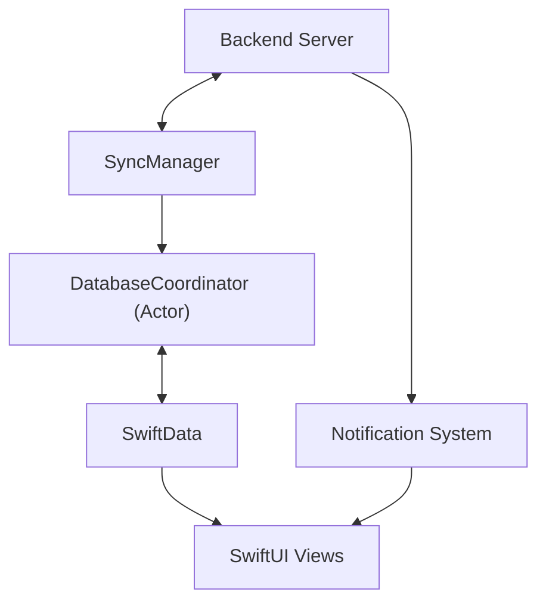
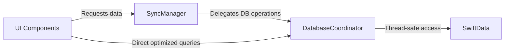
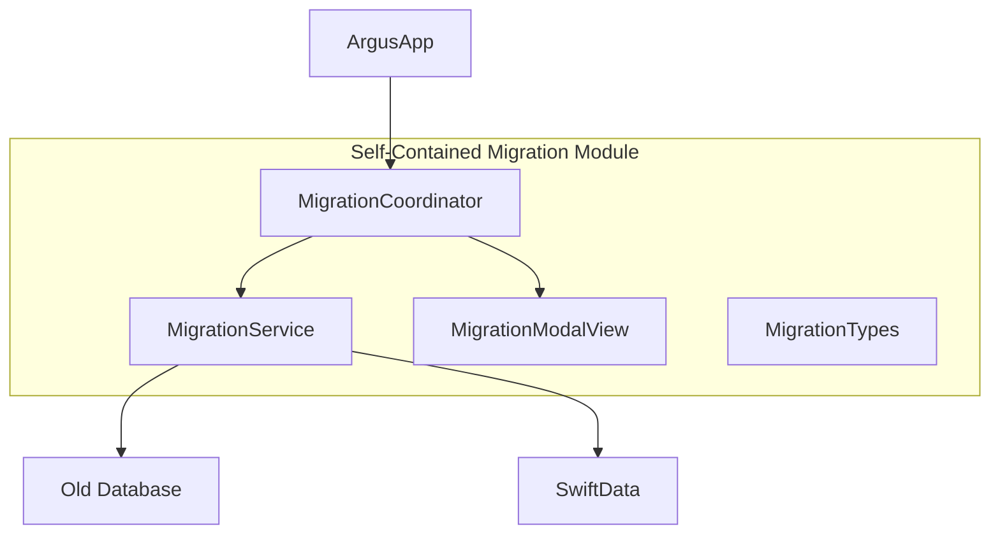
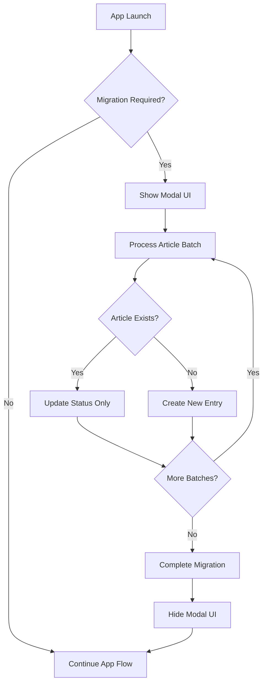
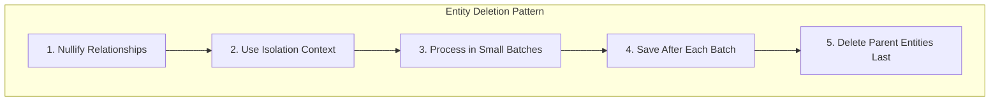
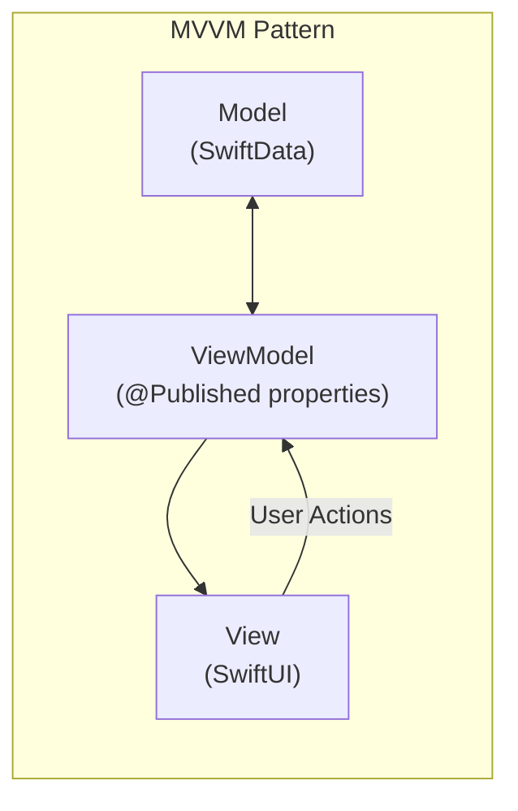
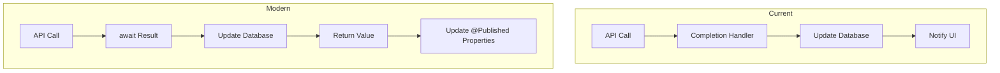

# System Patterns: Argus iOS App

## Architecture Overview
Argus implements a client-side architecture that focuses on:
1. Synchronizing with the backend server
2. Local data persistence with SwiftData
3. UI rendering with SwiftUI
4. Background processing and notifications



## Key Components

### Data Flow
- **APIClient**: Handles all communication with the backend server
- **SyncManager**: Orchestrates data synchronization between local storage and backend
- **DatabaseCoordinator**: Thread-safe actor that centralizes all database operations (Swift 6 compliant)
- **BackgroundContextManager**: Manages background tasks and sync operations

### UI Components
- **ContentView**: Main container view that handles navigation
- **NewsView**: Displays the list of news articles
- **NewsDetailView**: Shows the full article with AI insights
- **SubscriptionsView**: Manages user subscriptions
- **SettingsView**: Handles user preferences

### Data Processing
- **MarkdownUtilities**: Converts Markdown content to rich text with synchronized generation
- **QualityBadges**: Visual indicators for article quality metrics
- **ArticleModels**: Data models for articles and related entities
- **ArrayExtensions**: Provides utility extensions like chunking for batch processing

### System Services
- **NotificationUtils**: Manages push notifications
- **Logger**: Handles application logging

## Design Patterns

### Actor Pattern
The DatabaseCoordinator is implemented as a Swift actor to provide thread-safe access to the database. It ensures proper isolation and prevents concurrent access issues. All database operations are funneled through this coordinator.

```swift
actor DatabaseCoordinator {
    // Isolated state and operations
    
    func performTransaction<T>(_ operation: String, _ block: @Sendable (isolated DatabaseCoordinator, ModelContext) async throws -> T) async throws -> T {
        // Transaction handling with proper concurrency
    }
}
```

### Observer Pattern
Used for reactive UI updates when data changes, primarily through SwiftUI's @Published properties and ObservableObject protocol.

### Repository Pattern
The SyncManager acts as a repository, abstracting the data source from the UI components. It now delegates to the DatabaseCoordinator for all database operations, creating a clean separation of concerns:



The UI components (particularly NewsView) now have two data access paths:
1. Through SyncManager for general operations and data synchronization
2. Directly to DatabaseCoordinator for optimized, filtered queries like topic switching

### MVVM (Model-View-ViewModel)
- **Models**: ArticleModels, representing the core data
- **Views**: SwiftUI views like NewsView, NewsDetailView
- **ViewModels**: Implemented as ObservableObjects that prepare data for views

### Background Processing
Uses Swift's background task framework to perform sync operations when the app is in the background.

## Concurrency Patterns

### Actor-based Isolation
- Ensures thread safety for database operations
- Prevents race conditions and data corruption
- Compliant with Swift 6's stricter concurrency rules
- Handles non-Sendable types like NSAttributedString with proper boundaries
- Implements defensive design patterns to avoid SwiftData context access issues

### Two-Tier Cache for Topic Switching
- Uses in-memory caching for immediate UI feedback during topic changes
- Falls back to traditional filtering when direct database methods encounter issues
- Prevents EXC_BAD_ACCESS crashes during context.save() operations in SwiftData
- Gracefully handles context isolation failures with defensive programming

### Main Actor Constraints
- UI-related operations are explicitly tagged with @MainActor
- LazyLoadingContentView uses MainActor-constrained tasks for safe UI updates
- Prevents "called from background thread" warnings with proper context switching

### Task Management
- Uses structured concurrency with Task groups
- Properly handles task cancellation
- Leverages async/await for cleaner asynchronous code
- Ensures proper actor isolation when passing data between tasks

### Transaction Management
- Database operations are wrapped in transactions
- Proper error handling and rollback mechanisms
- Optimistic locking to prevent conflicts
- Safe fallback mechanisms for when transactions fail unexpectedly
- Context corruption detection and remediation strategies

### Synchronous Rich Text Generation
- Rich text generation for articles is performed synchronously during database transactions
- Uses `await MainActor.run { ... }` to ensure all rich text blobs are generated before completion
- Prevents duplicate articles with inconsistent rich text state
- Ensures UI always has access to pre-rendered rich text content

## Data Persistence
- SwiftData for local storage of articles and user preferences
- NSCache for in-memory caching of frequently accessed data
- Batch processing for efficient handling of multiple articles

### Self-Contained Migration Architecture

The migration system uses a coordinator pattern to ensure clean isolation and future removability:



This architecture ensures:
1. Single entry point through the MigrationCoordinator
2. Complete isolation of migration logic
3. Minimal touch points with the main application
4. Easy removal when migration is complete for all users

#### Migration Flow Process



The migration temporarily operates in a dual-database mode, where it:
1. Automatically runs on app startup
2. Uses blocking modal UI to prevent user interaction during migration
3. Performs state synchronization to keep old and new databases in sync
4. Will eventually be switchable to one-time migration mode
5. Can be completely removed from the codebase in a future update

### SwiftData Relationship Management

SwiftData's relationship handling requires special attention, particularly with bidirectional relationships and cascade delete rules:



#### Deletion Best Practices

1. **Break Circular References**:
   - Nullify relationships before deletion: `entity.relationships = []`
   - Save changes to commit relationship removal
   - Then proceed with actual entity deletion
   
2. **Dedicated Isolation Context**:
   - Create a fresh ModelContext specifically for deletion operations
   - Prevents context interference with UI-bound contexts
   - Avoids EXC_BAD_ACCESS crashes during complex operations

3. **Batched Processing**:
   - Process entities in small batches (5-10 items)
   - Perform intermediate saves between batches
   - Allows tracking progress and prevents memory buildup
   
4. **Deletion Order**:
   - Delete child entities before parent entities
   - Handle SeenArticle records first (no relationships)
   - Then handle Topics with cascade rules
   - Finally clean up any orphaned Articles
   
5. **Diagnostic Tracking**:
   - Log timing information at each step
   - Track relationship counts and entity states
   - Monitor for unexpected conditions

#### Example Implementation

```swift
// 1. Create isolated context
let deletionContext = container.newContext()

// 2. Break circular references
let articles = try deletionContext.fetch(FetchDescriptor<ArticleModel>())
for article in articles {
    article.topics = []
}
try deletionContext.save()

// 3. Delete in small batches with separate context
let topics = try deletionContext.fetch(FetchDescriptor<TopicModel>())
for batch in stride(from: 0, to: topics.count, by: 5) {
    let end = min(batch + 5, topics.count)
    for i in batch..<end {
        deletionContext.delete(topics[i])
    }
    try deletionContext.save()
}

// 4. Cleanup any orphaned entities
let remainingArticles = try deletionContext.fetch(FetchDescriptor<ArticleModel>())
for article in remainingArticles {
    deletionContext.delete(article)
}
try deletionContext.save()
```

This pattern avoids the EXC_BAD_ACCESS crashes and freezes that can occur when SwiftData attempts to maintain relationship integrity during deletion operations.

## Communication Patterns
- RESTful API calls to the backend server
- Push notifications for high-priority content
- Local notifications for background sync completion
- Notification Center for internal app communication

## Error Handling
- Graceful degradation when offline
- Retry logic for failed network requests
- User-friendly error messages
- Comprehensive logging for debugging purposes
- Structured error types with localized descriptions
- SwiftData context error recovery with multi-layer fallback mechanisms:
  1. First try optimized database method
  2. Fall back to cache if database operation fails
  3. Final fallback to traditional filtering for guaranteed results

## Testing Approach
- Unit tests for core business logic
- UI tests for critical user flows
- Mocked API responses for testing network-dependent features
- Stress testing for concurrency robustness

## Planned Architectural Evolution

Argus is scheduled for a significant architectural modernization to address existing limitations and improve overall performance and maintainability.

### From Current Architecture to MVVM + SwiftData

The current architecture will evolve from its current state to a more modern implementation:

```mermaid
flowchart TD
    subgraph "Current Architecture"
        Backend1["Backend Server"]
        SyncManager1["SyncManager"]
        DbCoord1["DatabaseCoordinator (Actor)"]
        LocalStorage1["SwiftData"]
        UI1["SwiftUI Views with\nEmbedded Logic"]
    end
    
    subgraph "Target Architecture"
        Backend2["Backend Server"]
        ApiClient["API Client\n(async/await)"]
        ArticleService["ArticleService\n(Repository)"]
        SwiftData["SwiftData"]
        ViewModel["ViewModels"]
        UI2["SwiftUI Views"]
    end
    
    Backend1 --> SyncManager1
    SyncManager1 --> DbCoord1
    DbCoord1 --> LocalStorage1
    LocalStorage1 --> UI1
    
    Backend2 --> ApiClient
    ApiClient --> ArticleService
    ArticleService --> SwiftData
    SwiftData --> ViewModel
    ViewModel --> UI2
```



### Key Architectural Changes

#### 1. MVVM Pattern Implementation

The current architecture follows a pattern closer to MVC with SwiftUI, where views contain significant amounts of business logic. This will be refactored to a proper MVVM (Model-View-ViewModel) pattern:

- **Models**: SwiftData models representing core data structures
- **Views**: SwiftUI views with minimal logic, focused on presentation
- **ViewModels**: New layer that will manage state, business logic, and data preparation for views



#### 2. SwiftData Migration

The current database implementation will be migrated to SwiftData, Apple's declarative persistence framework:

- Current models will be annotated with SwiftData's `@Model` macro
- Fetch descriptors will be replaced with SwiftData queries
- `DatabaseCoordinator` will be phased out in favor of SwiftData's context management
- Model relationships will be explicitly defined with SwiftData annotations

#### 3. Modern Swift Concurrency

The current architecture uses a mix of completion handlers, Combine, and actors. The modernization will standardize on Swift's concurrency model:

- All network calls will use `async/await` instead of completion handlers
- Background tasks will use structured concurrency with task groups
- Proper cancellation handling for background tasks
- Elimination of callback-based code in favor of await expressions



#### 4. Repository Pattern Enhancement

The current SyncManager acts as a repository but will be replaced with a more focused ArticleService:

- Clear separation between API communication and data persistence
- Simplified interface for ViewModels to access data
- Consistent error handling and retry policies
- Better separation of concerns for different data types

### Component Mapping

| Current Component | New Architecture Equivalent |
|-------------------|----------------------------|
| SyncManager | ArticleService |
| DatabaseCoordinator | SwiftData ModelContainer + ModelContext |
| NotificationCenter-based updates | @Published properties + ObservableObject |
| Direct UI database access | ViewModel-mediated access |
| BackgroundContextManager | Task + UNUserNotificationCenter |
| Push notification handling in AppDelegate | Focused async notification handlers |

### Implementation Phases

The modernization will follow a phased approach:

1. **SwiftData Model Definition**: Create all data models using SwiftData annotations
2. **API Client Refactoring**: Update the networking layer to use async/await
3. **Repository Layer**: Implement ArticleService to bridge API and persistence
4. **ViewModel Creation**: Develop ViewModels for all major views
5. **UI Refactoring**: Update SwiftUI views to use ViewModels
6. **Background Processing**: Modernize background tasks and push handling
7. **Legacy Code Removal**: Remove outdated components once functionality is verified
