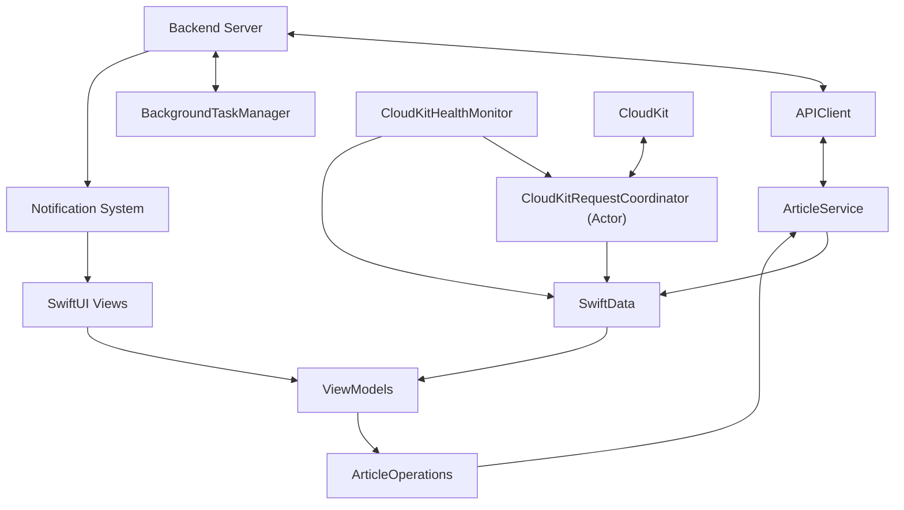
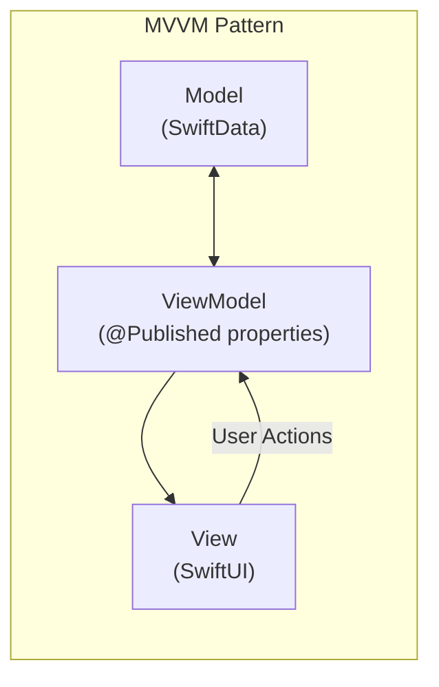
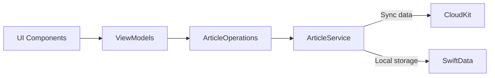
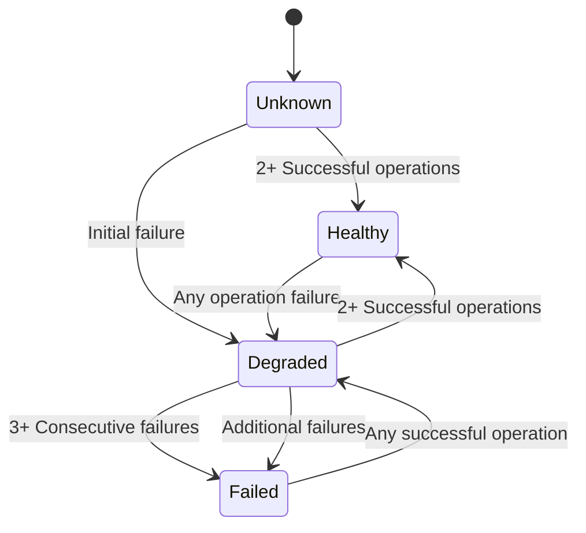
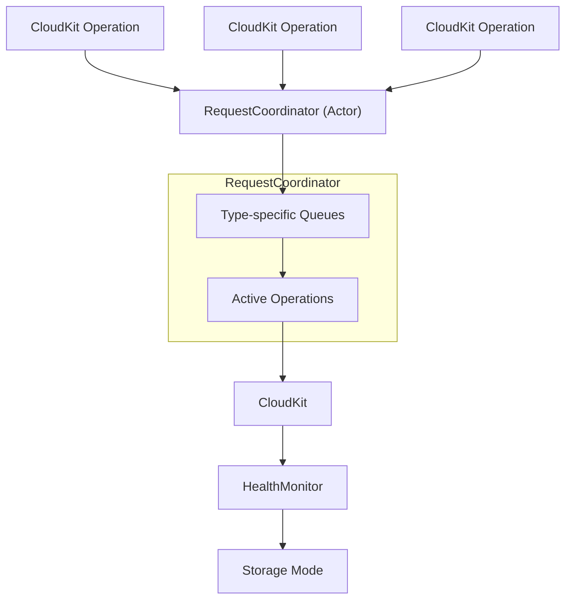
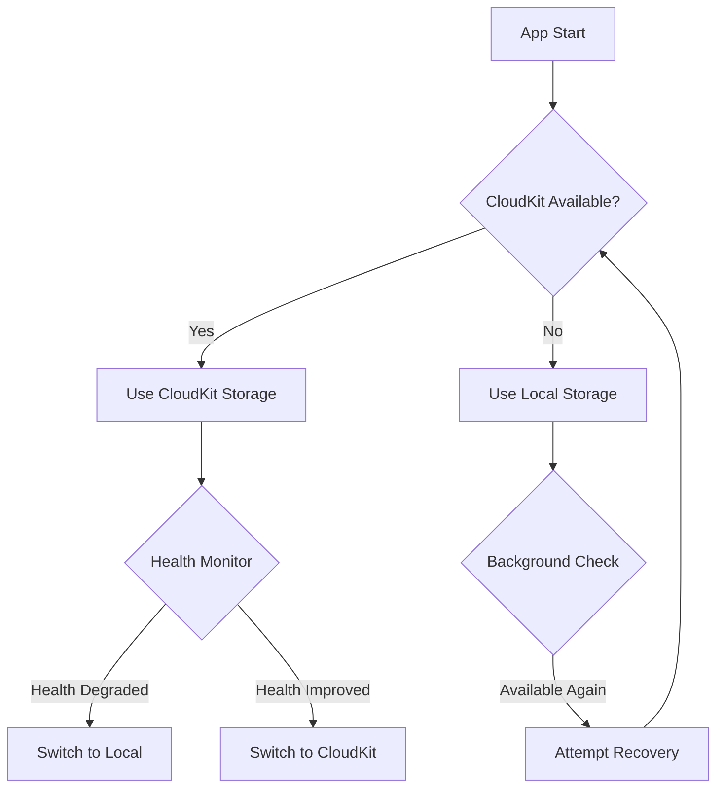
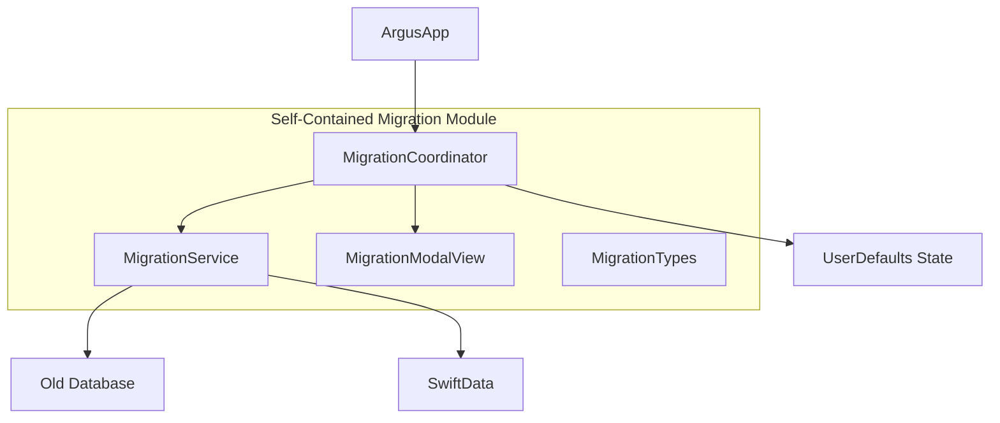
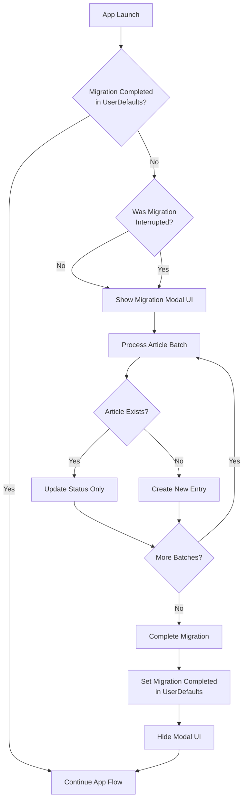
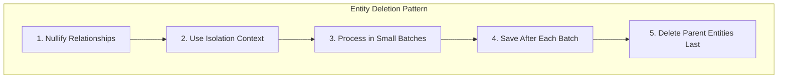
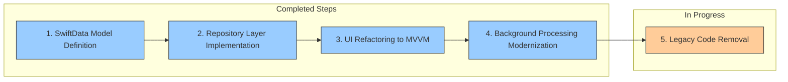

# System Patterns: Argus iOS App

## Architecture Overview
Argus implements a modern MVVM architecture with SwiftData persistence:
1. Synchronizing with the backend server using async/await
2. Local data persistence with SwiftData
3. UI rendering with SwiftUI and MVVM pattern
4. Background processing and notifications with modern Swift concurrency
5. CloudKit integration for cross-device syncing



## Key Components

### Data Flow
- **APIClient**: Handles all communication with the backend server using async/await
- **ArticleService**: Implements ArticleServiceProtocol with full SwiftData integration
- **ArticleOperations**: Business logic layer for article operations
- **BackgroundTaskManager**: Manages background tasks and sync operations with modern Swift concurrency

### UI Components (MVVM Pattern)
- **SwiftUI Views**: 
  - **ContentView**: Main container view that handles navigation
  - **NewsView**: Displays the list of news articles
  - **NewsDetailView**: Shows the full article with AI insights
  - **SubscriptionsView**: Manages user subscriptions
  - **SettingsView**: Handles user preferences
- **ViewModels**:
  - **NewsViewModel**: Manages article list state and operations
  - **NewsDetailViewModel**: Handles article detail view state and interactions
  - Both implement @MainActor and use @Published properties for reactive UI updates

### Data Models
- **ArticleModel**: SwiftData model with @Model annotation
- **SeenArticleModel**: SwiftData model for tracking viewed articles
- **TopicModel**: SwiftData model for topic management
- All models include proper relationships with appropriate cascade rules

### Data Processing
- **MarkdownUtilities**: Converts Markdown content to rich text with synchronized generation
- **QualityBadges**: Visual indicators for article quality metrics
- **ArticleDataModels**: SwiftData models for articles and related entities
- **ArrayExtensions**: Provides utility extensions like chunking for batch processing

### System Services
- **NotificationUtils**: Manages push notifications
- **Logger**: Handles application logging
- **ModernizationLogger**: Specialized logging for transition period diagnostics

## Design Patterns

### MVVM (Model-View-ViewModel)
The app has been fully refactored to follow the MVVM pattern:



- **Models**: ArticleModel, SeenArticleModel, and TopicModel with SwiftData annotations
- **Views**: SwiftUI views like NewsView, NewsDetailView with minimal business logic
- **ViewModels**: NewsViewModel, NewsDetailViewModel as ObservableObjects with @Published properties

Key MVVM implementations:
- ViewModels are properly isolated with @MainActor
- Business logic is located in ViewModels, not in Views
- Data access is mediated through ArticleOperations
- State changes are reflected through @Published properties
- UI updates reactively based on ViewModel changes

### Repository Pattern
The ArticleService acts as a repository, implementing the ArticleServiceProtocol:



Key repository features:
- Complete implementation of ArticleServiceProtocol
- Thread-safety using serial dispatch queue for cache operations
- Comprehensive error handling and error propagation
- Three-phase loading approach for rich text content
- Robust caching strategy with proper invalidation

### Actor Pattern
CloudKit operations are implemented using the Swift actor pattern to provide thread-safe access:

```swift
actor CloudKitRequestCoordinator {
    // Isolated state and operations
    
    func enqueueRequest<T>(_ operation: String, priority: OperationPriority, _ block: @Sendable () async throws -> T) async throws -> T {
        // Request handling with proper concurrency
    }
}
```

### Observer Pattern
Used for reactive UI updates when data changes, primarily through:
- SwiftUI's @Published properties
- ObservableObject protocol conformance
- Combine-based observation for UserDefaults changes

### CloudKit Integration Patterns

### Health Monitoring State Machine
The CloudKit integration uses a state machine pattern to track and manage CloudKit operational health:



This state machine:
- Tracks CloudKit operational health through successive operations
- Allows for immediate degradation but requires multiple successes for recovery
- Enables threshold-based decisions for fallback to local storage
- Provides clear state transitions for UI notifications

### CloudKit Request Coordination
The CloudKit request coordination uses a priority queue system with type isolation:



Key aspects:
- Operations are categorized by type (export, import, setup, fetch, modify)
- Only one operation of each type can run at a time
- Pending operations are queued based on priority
- Results feed back to the health monitoring system
- Proper error handling with consistent reporting

### Graceful Degradation Pattern
The system implements a graceful degradation pattern for CloudKit failures:



This pattern ensures:
- System always starts in an operational state regardless of CloudKit availability
- Runtime failures trigger graceful mode switching without data loss
- Transparent recovery when conditions improve
- Users are notified of important state changes
- Periodic background checks attempt recovery automatically

## Background Processing
The BackgroundTaskManager implements modern Swift concurrency patterns:
- Uses Swift's BGTaskScheduler for system background tasks
- Implements async/await for asynchronous operations
- Properly handles task timeout and cancellation
- Manages network connectivity requirements
- Provides intelligent scheduling based on user activity patterns

## Concurrency Patterns

### Modern Swift Concurrency
- All network operations use async/await instead of completion handlers
- Background processing uses structured concurrency with task groups
- Proper timeout and cancellation handling
- MainActor isolation for UI components
- Actor-based isolation for shared resources

### Two-Tier Cache for Topic Switching
- Uses in-memory caching for immediate UI feedback during topic changes
- Falls back to traditional filtering when direct database methods encounter issues
- Prevents EXC_BAD_ACCESS crashes during context.save() operations in SwiftData
- Gracefully handles context isolation failures with defensive programming

### Main Actor Constraints
- UI-related operations are explicitly tagged with @MainActor
- ViewModels use @MainActor annotation for thread safety
- Prevents "called from background thread" warnings with proper context switching
- Rich text generation properly isolated to avoid UI thread blocking

### Task Management
- Uses structured concurrency with Task groups
- Properly handles task cancellation
- Leverages async/await for cleaner asynchronous code
- Ensures proper actor isolation when passing data between tasks

### Transaction Management
- Database operations are wrapped in transactions
- Proper error handling and rollback mechanisms
- Optimistic locking to prevent conflicts
- Safe fallback mechanisms for when transactions fail unexpectedly
- Context corruption detection and remediation strategies

### Synchronous Rich Text Generation
- Rich text generation for articles is performed synchronously during database transactions
- Uses `await MainActor.run { ... }` to ensure all rich text blobs are generated before completion
- Prevents duplicate articles with inconsistent rich text state
- Ensures UI always has access to pre-rendered rich text content

## Data Persistence
- SwiftData for local storage of articles and user preferences
- NSCache for in-memory caching of frequently accessed data
- Batch processing for efficient handling of multiple articles

### One-Time Migration Architecture

The migration system uses a coordinator pattern to ensure clean isolation and future removability, with an emphasis on running exactly once per device:



This architecture ensures:
1. Single entry point through the MigrationCoordinator
2. Complete isolation of migration logic
3. Minimal touch points with the main application
4. One-time execution with persistent state tracking
5. Easy removal when migration is complete for all users

#### One-Time Migration Flow



The migration now operates with a true one-time approach, where it:
1. Checks if migration is already completed using UserDefaults
2. Only runs once per device, even after app updates or reinstalls
3. Uses blocking modal UI to prevent user interaction during migration
4. Creates a read-only view of the legacy database for migration purposes
5. Maintains resilience for interrupted migrations with progress tracking
6. Can be completely removed from the codebase in a future update once all users have migrated

### SwiftData Relationship Management

SwiftData's relationship handling requires special attention, particularly with bidirectional relationships and cascade delete rules:



#### Deletion Best Practices

1. **Break Circular References**:
   - Nullify relationships before deletion: `entity.relationships = []`
   - Save changes to commit relationship removal
   - Then proceed with actual entity deletion
   
2. **Dedicated Isolation Context**:
   - Create a fresh ModelContext specifically for deletion operations
   - Prevents context interference with UI-bound contexts
   - Avoids EXC_BAD_ACCESS crashes during complex operations

3. **Batched Processing**:
   - Process entities in small batches (5-10 items)
   - Perform intermediate saves between batches
   - Allows tracking progress and prevents memory buildup
   
4. **Deletion Order**:
   - Delete child entities before parent entities
   - Handle SeenArticle records first (no relationships)
   - Then handle Topics with cascade rules
   - Finally clean up any orphaned Articles
   
5. **Diagnostic Tracking**:
   - Log timing information at each step
   - Track relationship counts and entity states
   - Monitor for unexpected conditions

#### Example Implementation

```swift
// 1. Create isolated context
let deletionContext = container.newContext()

// 2. Break circular references
let articles = try deletionContext.fetch(FetchDescriptor<ArticleModel>())
for article in articles {
    article.topics = []
}
try deletionContext.save()

// 3. Delete in small batches with separate context
let topics = try deletionContext.fetch(FetchDescriptor<TopicModel>())
for batch in stride(from: 0, to: topics.count, by: 5) {
    let end = min(batch + 5, topics.count)
    for i in batch..<end {
        deletionContext.delete(topics[i])
    }
    try deletionContext.save()
}

// 4. Cleanup any orphaned entities
let remainingArticles = try deletionContext.fetch(FetchDescriptor<ArticleModel>())
for article in remainingArticles {
    deletionContext.delete(article)
}
try deletionContext.save()
```

This pattern avoids the EXC_BAD_ACCESS crashes and freezes that can occur when SwiftData attempts to maintain relationship integrity during deletion operations.

## Communication Patterns
- RESTful API calls to the backend server using async/await
- Push notifications for high-priority content
- Local notifications for background sync completion
- Notification Center for internal app communication

## Error Handling
- Graceful degradation when offline
- Retry logic for failed network requests
- User-friendly error messages
- Comprehensive logging for debugging purposes
- Structured error types with localized descriptions
- SwiftData context error recovery with multi-layer fallback mechanisms:
  1. First try optimized database method
  2. Fall back to cache if database operation fails
  3. Final fallback to traditional filtering for guaranteed results
- CloudKit error handling with state-based recovery:
  1. Detect CloudKit issues using health monitoring state machine
  2. Switch to local storage when CloudKit fails repeatedly
  3. Provide user feedback through notifications
  4. Attempt automatic recovery when conditions improve
  5. Monitor system events (account changes, network availability) for recovery triggers

## Testing Approach
- Unit tests for core business logic
- UI tests for critical user flows
- Mocked API responses for testing network-dependent features
- Stress testing for concurrency robustness

## Current Architecture Implementation Status

The Argus app has successfully implemented most of the planned architectural modernization, with only the final legacy code removal step remaining.

### Completed Modernization Steps



#### 1. SwiftData Model Definition ✅
- Implemented `ArticleModel`, `SeenArticleModel`, and `TopicModel` with @Model annotations
- Defined relationships with appropriate cascade rules
- Added CloudKit compatibility with default values for required properties
- Created API compatibility extensions to bridge between old and new models

#### 2. Repository Layer Implementation ✅
- Created complete implementation of `ArticleServiceProtocol` with modern Swift concurrency
- Implemented thread-safety using serial dispatch queue for cache operations
- Added comprehensive error handling with proper error types and propagation
- Developed blob storage and retrieval with three-phase loading approach

#### 3. UI Refactoring to MVVM ✅
- Implemented well-structured ViewModels with @MainActor annotations
- Added reactive UI updates using @Published properties
- Created Combine integration for settings observation
- Implemented proper dependency injection patterns
- Established clean separation of UI logic from business logic

#### 4. Background Processing Modernization ✅
- Implemented modern Swift concurrency with async/await
- Added structured concurrency with task groups
- Implemented proper timeout and cancellation handling
- Created network-aware scheduling with proper power requirements
- Developed BGTaskScheduler implementation with proper expiration handling

#### 5. Legacy Code Removal (In Progress) ⏳
- Transition from `MigrationAwareArticleService` to `ArticleService` (Partially Complete)
- Remove remaining `NotificationData` references (Partially Complete)
- Clean up temporary migration bridges
- Remove redundant compatibility code

### Component Transformation

| Original Component | Transformed To | Status |
|-------------------|----------------------------|--------|
| SyncManager | ArticleService | ✅ Complete |
| DatabaseCoordinator | SwiftData ModelContainer + ModelContext | ✅ Complete |
| NotificationCenter-based updates | @Published properties + ObservableObject | ✅ Complete |
| Direct UI database access | ViewModel-mediated access | ✅ Complete |
| BackgroundContextManager | BackgroundTaskManager with Task groups | ✅ Complete |
| Manual CloudKit checks | CloudKitHealthMonitor + CloudKitRequestCoordinator | ✅ Complete |
| Completion handler-based API client | Async/await APIClient | ✅ Complete |

This architectural transformation has significantly improved code quality, maintainability, and performance while setting the foundation for future development.
