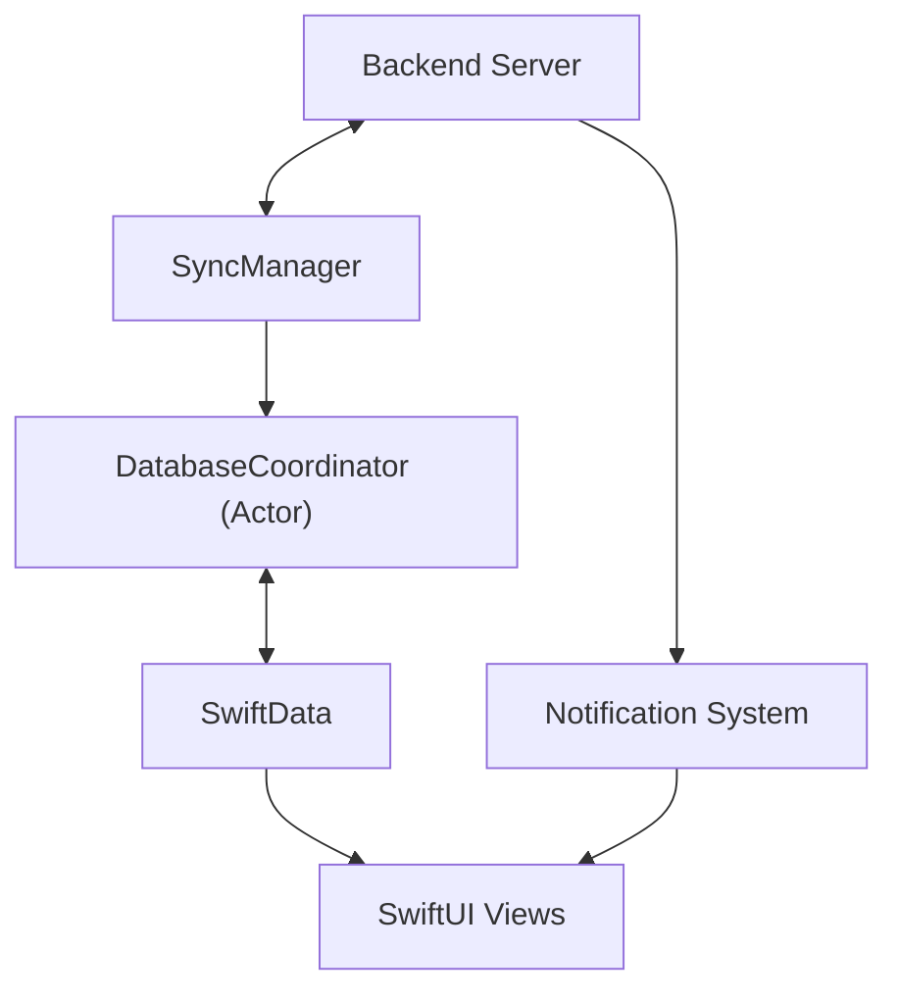
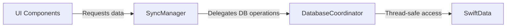

# System Patterns: Argus iOS App

## Architecture Overview
Argus implements a client-side architecture that focuses on:
1. Synchronizing with the backend server
2. Local data persistence with SwiftData
3. UI rendering with SwiftUI
4. Background processing and notifications



## Key Components

### Data Flow
- **APIClient**: Handles all communication with the backend server
- **SyncManager**: Orchestrates data synchronization between local storage and backend
- **DatabaseCoordinator**: Thread-safe actor that centralizes all database operations (Swift 6 compliant)
- **BackgroundContextManager**: Manages background tasks and sync operations

### UI Components
- **ContentView**: Main container view that handles navigation
- **NewsView**: Displays the list of news articles
- **NewsDetailView**: Shows the full article with AI insights
- **SubscriptionsView**: Manages user subscriptions
- **SettingsView**: Handles user preferences

### Data Processing
- **MarkdownUtilities**: Converts Markdown content to rich text
- **QualityBadges**: Visual indicators for article quality metrics
- **ArticleModels**: Data models for articles and related entities
- **ArrayExtensions**: Provides utility extensions like chunking for batch processing

### System Services
- **NotificationUtils**: Manages push notifications
- **Logger**: Handles application logging

## Design Patterns

### Actor Pattern
The DatabaseCoordinator is implemented as a Swift actor to provide thread-safe access to the database. It ensures proper isolation and prevents concurrent access issues. All database operations are funneled through this coordinator.

```swift
actor DatabaseCoordinator {
    // Isolated state and operations
    
    func performTransaction<T>(_ operation: String, _ block: @Sendable (isolated DatabaseCoordinator, ModelContext) async throws -> T) async throws -> T {
        // Transaction handling with proper concurrency
    }
}
```

### Observer Pattern
Used for reactive UI updates when data changes, primarily through SwiftUI's @Published properties and ObservableObject protocol.

### Repository Pattern
The SyncManager acts as a repository, abstracting the data source from the UI components. It now delegates to the DatabaseCoordinator for all database operations, creating a clean separation of concerns:



### MVVM (Model-View-ViewModel)
- **Models**: ArticleModels, representing the core data
- **Views**: SwiftUI views like NewsView, NewsDetailView
- **ViewModels**: Implemented as ObservableObjects that prepare data for views

### Background Processing
Uses Swift's background task framework to perform sync operations when the app is in the background.

## Concurrency Patterns

### Actor-based Isolation
- Ensures thread safety for database operations
- Prevents race conditions and data corruption
- Compliant with Swift 6's stricter concurrency rules
- Handles non-Sendable types like NSAttributedString with proper boundaries

### Main Actor Constraints
- UI-related operations are explicitly tagged with @MainActor
- LazyLoadingContentView uses MainActor-constrained tasks for safe UI updates
- Prevents "called from background thread" warnings with proper context switching

### Task Management
- Uses structured concurrency with Task groups
- Properly handles task cancellation
- Leverages async/await for cleaner asynchronous code
- Ensures proper actor isolation when passing data between tasks

### Transaction Management
- Database operations are wrapped in transactions
- Proper error handling and rollback mechanisms
- Optimistic locking to prevent conflicts

## Data Persistence
- SwiftData for local storage of articles and user preferences
- NSCache for in-memory caching of frequently accessed data
- Batch processing for efficient handling of multiple articles

## Communication Patterns
- RESTful API calls to the backend server
- Push notifications for high-priority content
- Local notifications for background sync completion
- Notification Center for internal app communication

## Error Handling
- Graceful degradation when offline
- Retry logic for failed network requests
- User-friendly error messages
- Comprehensive logging for debugging purposes
- Structured error types with localized descriptions

## Testing Approach
- Unit tests for core business logic
- UI tests for critical user flows
- Mocked API responses for testing network-dependent features
- Stress testing for concurrency robustness
