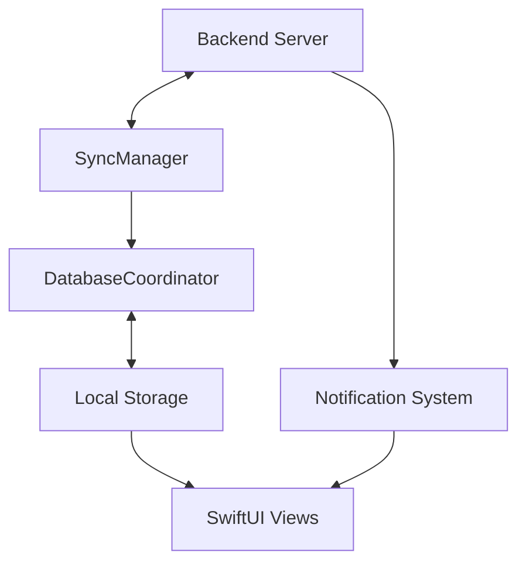

# System Patterns: Argus iOS App

## Architecture Overview
Argus implements a client-side architecture that focuses on:
1. Synchronizing with the backend server
2. Local data persistence
3. UI rendering with SwiftUI
4. Background processing and notifications

## Key Components

### Data Flow
- **APIClient**: Handles all communication with the backend server
- **SyncManager**: Orchestrates data synchronization between local storage and backend
- **DatabaseCoordinator**: Centralizes all database operations using Swift actor model
- **BackgroundContextManager**: Manages background tasks and sync operations
- **ArticleQueueModel**: Manages the queue of articles to be processed and displayed

### UI Components
- **ContentView**: Main container view that handles navigation
- **NewsView**: Displays the list of news articles
- **NewsDetailView**: Shows the full article with AI insights
- **SubscriptionsView**: Manages user subscriptions
- **SettingsView**: Handles user preferences

### Data Processing
- **MarkdownUtilities**: Converts Markdown content to rich text
- **QualityBadges**: Visual indicators for article quality metrics
- **ArticleModels**: Data models for articles and related entities

### System Services
- **NotificationUtils**: Manages push notifications
- **Logger**: Handles application logging

## Design Patterns

### Observer Pattern
Used for reactive UI updates when data changes, primarily through SwiftUI's @Published properties and ObservableObject protocol.

### Repository Pattern
The SyncManager acts as a repository, abstracting the data source from the UI components. Views don't need to know if data comes from local storage or the network.

### MVVM (Model-View-ViewModel)
- **Models**: ArticleModels, representing the core data
- **Views**: SwiftUI views like NewsView, NewsDetailView
- **ViewModels**: Implemented as ObservableObjects that prepare data for views

### Background Processing
Uses Swift's background task framework to perform sync operations when the app is in the background.

## Data Persistence
- Local storage for articles and user preferences
- Caching of images and content for offline access
- Persistence of reading position and history

## Communication Patterns
- RESTful API calls to the backend server
- Push notifications for high-priority content
- Local notifications for background sync completion

## Error Handling
- Graceful degradation when offline
- Retry logic for failed network requests
- User-friendly error messages
- Logging for debugging purposes

## Testing Approach
- Unit tests for core business logic
- UI tests for critical user flows
- Mocked API responses for testing network-dependent features
